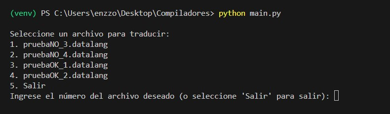
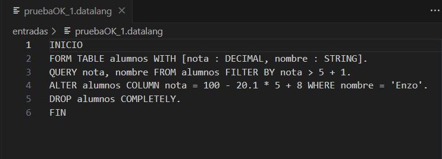
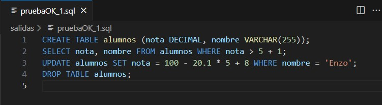
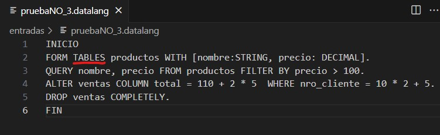
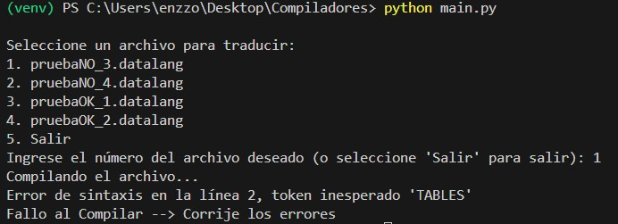
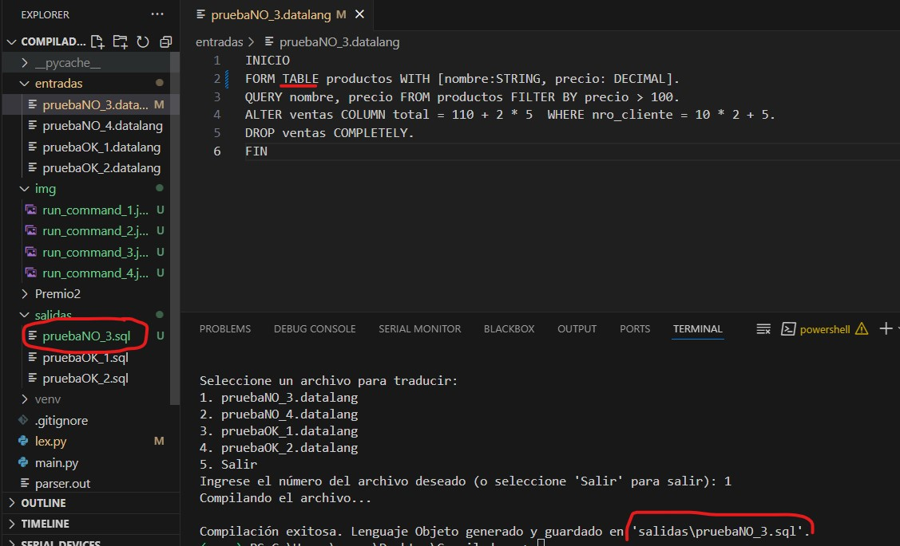
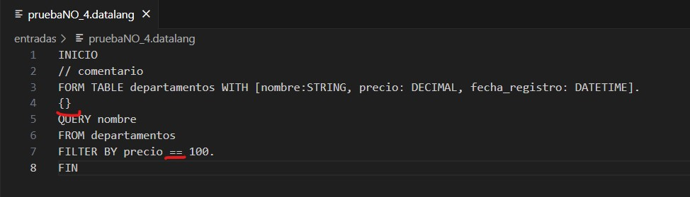
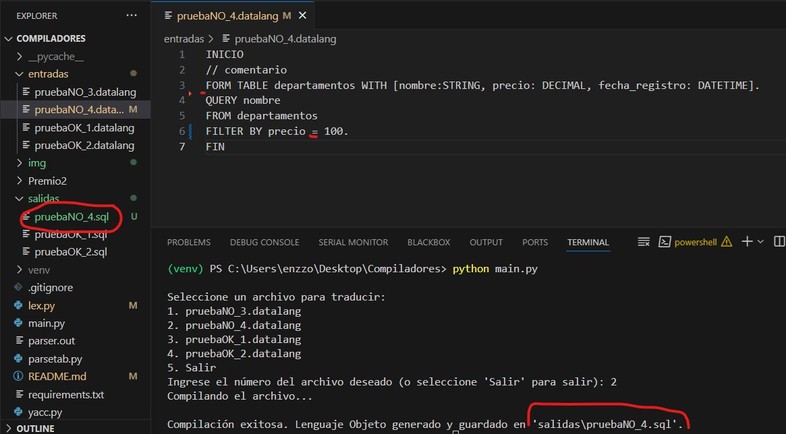

Paso 0. Abrir la terminal desde el directorio del repo

Ejecuta el siguiente comando para crear el entorno virtual:

```bash
python -m venv venv
```

Paso 1. Activa el entorno virtual:

En Windows:

```bash
venv\Scripts\activate
```

En macOS/Linux:
```bash
source venv/bin/activate
```

Se deberia ver como
```bash
 (venv) /tu_path> $ 
```


Paso 2. Usar `requirements.txt` para Instalar Dependencias
Si necesitas instalar todas las dependencias listadas en el archivo `requirements.txt`, ejecuta:

```bash
pip install -r requirements.txt
```

Si quiere desactivar el entorno virtual:

```bash
deactivate 
```

3. EL archivo `lex.py` contiene la definicion de los tokens, el archivo `yacc.py` contiene la definicion e las reglas de sintaxis que debe seguir nuestro lenguaje asignado y el archivo `main.py` es un archivo donde se encuentra la aplicacion a ejecutar, entonces desde la consola ubicacado en la ruta de nuestro proyeto puedes correr el comando

```bash
python main.py
```

Al ejecutar este comando veras un Menu desde la misma consola con opciones para elegir un archivo e intentar compilarlo al lenguaje objeto o salir de la aplicacion.



Aqui debes seleccionar una opcion de las que aparece en el menu, este muestra 4 Archivos con los que realizamos pruebas de nuestro compilador

Archivos:
* `pruebaOK_1.datalang` : Este archivo no contiene errores y se compila y genera el lenguaje objeto en la carpeta `./salidas/` con el nombre `pruebaOK_1.sql`

* `pruebaOK_2.datalang` : Este archivo no contiene errores y se compila y genera el lenguaje objeto en la carpeta `./salidas/` con el nombre `pruebaOK_2.sql`

Para probar la compilacion de el mismo archivos sin errores mas de una vez, debe comprobar que no exista el archivo `.sql` con el nombre del archivo que desea compilar, de ser asi, debe borrar el archivo de salida previamente generado. (sino agrega contenido, no lo sobreescribe)

Al intentar compilar un archivo que no contiene error la salida deberia verse de esta manera


Y podra encontrar el contenido del lenguaje generado si el archivo no contenia ningun tipo de error en la carpeta salida:

EJEMPLO:

* Archivo lenguaje fuente sin errores: `pruebaOK_1.datalang`



* Archivo lenguaje objeto generado: `pruebaOK_1.sql`



Puedes seguir los mismos pasos para el otro archivo de pruebas sin errores, ese muestra como ignora los comentarios y que pasa cuando las instrucciones no estan en lineas diferentes sino dos instruccion en la misma separadas por un --> `.` Y de la misma forma genera un archivo como lenguaje objeto al no contener errores.

Para probar los archivos con errores tenemos:

* `pruebaNO_3.datalang` : Este archivo contiene errores de sintaxis



Y cuando intentamos compilar la aplicacion nos da el siguiente resultado:



Para que pueda ser compilado y generar el lenguaje objeto debemos corregir todos los errores en ese archivo y luego procedemos a intentar compilar



* `pruebaNO_4.datalang` : Este archivo contiene errores lexicos y de sintaxis



Y cuando intentamos compilar la aplicacion nos da el siguiente resultado:


Para que pueda ser compilado y generar el lenguaje objeto debemos corregir todos los errores en ese archivo y luego procedemos a intentar compilar



De esta forma podemos agregar archivos nuevos a la carpeta `./entradas` y apareceran en la lista de posibles archivos a compilar del menu de la aplicacion para probar si tienen o no errores en el proceso e compilacion y generacion del lenguaje objeto.


Alumnos:
  - Juarez Velazquez Enzo Jesus. DNI:42520547
  - Cordoba Escalante, Ariel Oscar. DNI:4217455